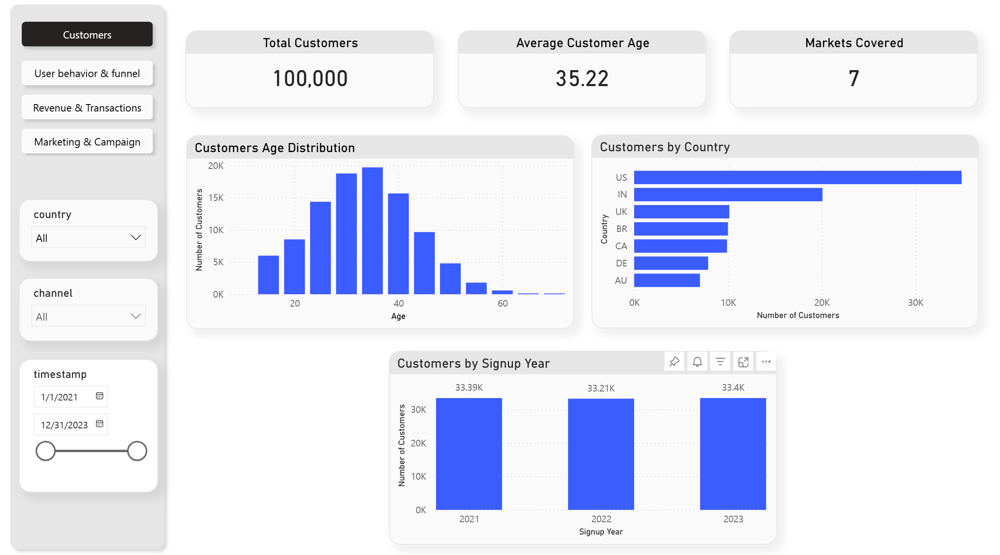
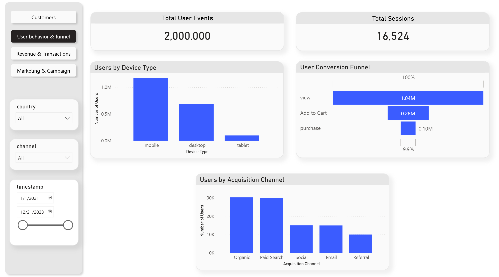
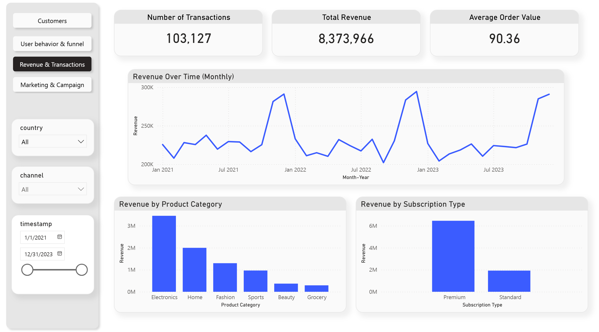
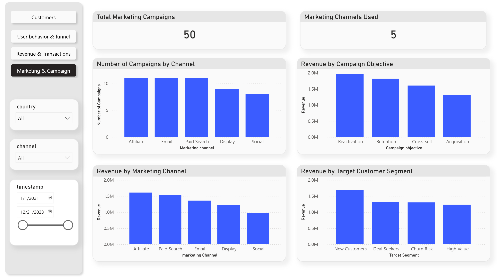

# E-Commerce Analytics Dashboard (Power BI)

## Overview

This project presents an interactive **Power BI dashboard** designed to analyze the performance of an e-commerce business across customers, user behavior, revenue, and marketing campaigns.

The focus is on delivering **clear, business-ready insights** rather than complex or overloaded visuals, making the dashboard easy to interpret for both technical and non-technical stakeholders.

---

## Business Questions

The dashboard is built to answer practical business questions such as:

- Who are our customers and how are they distributed across markets and age groups?
- How do users move through the conversion funnel from view to purchase?
- How does revenue evolve over time and across product categories?
- Which marketing channels and campaign objectives generate the most revenue?
- How do acquisition channels and customer segments differ in performance?

---

## Dashboard

### Dashboard Demo

Click the image below to watch a short demo of the dashboard and its interactivity.

---

### Customers Overview

---

### User Behavior & Funnel

---

### Revenue & Transactions

---

### Marketing & Campaign Performance

Each page is designed to be interpretable on its own, while remaining fully connected through shared filters.

---

## Data Model & Sources

The dashboard is built on a **relational data model** with separate fact and dimension tables, including:

- Customers  
- Transactions  
- Events  
- Products  
- Campaigns  

**Data source:**  
https://www.kaggle.com/datasets/geethasagarbonthu/marketing-and-e-commerce-analytics-dataset

---

## Key Features

- Global slicers for **date**, **country**, and **marketing channel**
- Cross-page filtering for consistent analysis
- KPI cards for high-level performance monitoring
- Clean, business-focused layout optimized for decision-making

---

## Tools

- Power BI Desktop  
- DAX (measures and KPIs)  
- Power Query (data preparation)

---
